<!-- 6a5e7284-6918-4809-9325-faba2d4a9fdd -->
---
todos:
  - id: "add-dep"
    content: "Add json-schema-validator/2.4.0 to conandata.yml and wire find_package + target_link_libraries in Data/CMakeLists.txt"
    status: pending
  - id: "reflect-to-schema"
    content: "Add SchemaFromReflection.h with BuildJsonSchema<T>() and BinarySchemaFromType<T>() that derive schemas from GetTypeInfo<T>()"
    status: pending
  - id: "json-schema-validator"
    content: "Create DotEngine/Data/src/Validation/JsonSchemaValidator.h wrapping nlohmann json-schema-validator, fed by BuildJsonSchema<T>()"
    status: pending
  - id: "binary-schema-validator"
    content: "Create DotEngine/Data/src/Validation/BinarySchemaValidator.h validating BinaryHeader + payload size derived from TypeInfo"
    status: pending
  - id: "binary-serializer"
    content: "Create DotEngine/Data/src/Serialization/BinarySerializer.h with Load/Save and BinarySchemaValidator integration"
    status: pending
  - id: "wire-json-serializer"
    content: "Modify JsonSerializer::Load() to build and run JsonSchemaValidator from reflection before field mapping"
    status: pending
  - id: "update-dotdata-h"
    content: "Update DotData.h and Data/CMakeLists.txt to include the new headers"
    status: pending
isProject: false
---
# Data Validation Layer Plan

## Architecture Overview

```mermaid
flowchart TD
    subgraph reflection [Reflection - compile time]
        R["GetTypeInfo&lt;T&gt;()"] --> JS["BuildJsonSchema&lt;T&gt;()"]
        R --> BS["BinarySchemaFromType&lt;T&gt;()"]
    end

    subgraph json_path [JSON Path]
        A[StorageLayer::ReadText] --> B["nlohmann::json::parse"]
        JS --> C["JsonSchemaValidator::Validate(json)"]
        B --> C
        C -->|valid| D["JsonSerializer::Load - field mapping"]
        C -->|invalid| E1[Return error]
        D --> F["Validator&lt;T&gt;::Validate - semantic rules"]
    end

    subgraph bin_path [Binary Path]
        G["StorageLayer::ReadBytes"] --> H["BinarySchemaValidator::Validate(bytes)"]
        BS --> H
        H -->|valid| I["BinarySerializer::Load - payload mapping"]
        H -->|invalid| E2[Return error]
        I --> J["Validator&lt;T&gt;::Validate - semantic rules"]
    end
```



## New Files

### `DotEngine/Data/src/Validation/SchemaFromReflection.h`
The key new piece. Uses `GetTypeInfo<T>()` from [`Reflect.h`](DotEngine/Data/src/Reflection/Reflect.h) to auto-generate schemas — no hand-written schema strings ever needed.

**`BuildJsonSchema<T>()`** — produces a `nlohmann::json` JSON Schema object:
```cpp
// FieldType mapping: Int/UInt32 -> "integer", Float/Double -> "number",
//                   Bool -> "boolean", String -> "string"
template<typename T>
nlohmann::json BuildJsonSchema();
```
Output structure matches the DotData envelope:
```json
{
  "required": ["version", "type", "data"],
  "properties": {
    "data": {
      "required": ["fieldA", "fieldB"],
      "properties": { "fieldA": {"type": "integer"}, ... }
    }
  }
}
```

**`BinarySchemaFromType<T>()`** — produces a `BinarySchema` struct:
```cpp
template<typename T>
BinarySchema BinarySchemaFromType(Version minVer, Version maxVer = 0);
```
- `expectedTypeHash` = `FNV1a(GetTypeInfo<T>().typeName)` (reuses existing `FNV1a` from [`DataVersion.h`](DotEngine/Data/src/Versioning/DataVersion.h))
- `minTotalBytes` = `sizeof(BinaryHeader)` + sum of field sizes derived from `FieldType`

### `DotEngine/Data/src/Validation/JsonSchemaValidator.h`
Wraps `nlohmann/json-schema-validator`. Schema is provided as a `nlohmann::json` (produced by `BuildJsonSchema<T>()`), not a raw string.

```cpp
class JsonSchemaValidator {
public:
    explicit JsonSchemaValidator(nlohmann::json schema);
    ValidationResult Validate(const nlohmann::json& doc) const;
};
```

### `DotEngine/Data/src/Validation/BinarySchemaValidator.h`
No third-party library — validated against [`DataVersion.h`](DotEngine/Data/src/Versioning/DataVersion.h) `BinaryHeader`.

```cpp
struct BinarySchema {
    uint32_t expectedTypeHash;
    Version  minVersion;
    Version  maxVersion;      // 0 = no upper bound
    size_t   minTotalBytes;
};

class BinarySchemaValidator {
public:
    explicit BinarySchemaValidator(BinarySchema schema);
    ValidationResult Validate(std::span<const std::byte> buf) const;
};
```
Checks in order: buffer size >= `sizeof(BinaryHeader)`, magic == `BINARY_MAGIC`, version in range, typeHash matches.

### `DotEngine/Data/src/Serialization/BinarySerializer.h`
Mirror of [`JsonSerializer.h`](DotEngine/Data/src/Serialization/JsonSerializer.h) for binary files. `Load()` calls `BinarySchemaFromType<T>()` + `BinarySchemaValidator` before payload parsing. Uses reflection for field layout.

## Modified Files

### [`DotEngine/Data/src/Serialization/JsonSerializer.h`](DotEngine/Data/src/Serialization/JsonSerializer.h)
`Load()` now calls `BuildJsonSchema<T>()` and runs `JsonSchemaValidator` internally — no caller changes needed:

```cpp
// Inside Load(), before field mapping:
auto schema = BuildJsonSchema<T>();
JsonSchemaValidator validator(std::move(schema));
auto result = validator.Validate(root);
if (!result.valid) return false;
```

### [`DotEngine/Data/src/DotData.h`](DotEngine/Data/src/DotData.h)
Include `SchemaFromReflection.h`, `JsonSchemaValidator.h`, `BinarySchemaValidator.h`, and `BinarySerializer.h`.

### [`DotEngine/Data/CMakeLists.txt`](DotEngine/Data/CMakeLists.txt)
- Add `json-schema-validator/2.4.0` to [`conandata.yml`](conandata.yml)
- Add `find_package(nlohmann_json_schema_validator REQUIRED)` and `target_link_libraries(... nlohmann_json_schema_validator::validator)`
- Add new `.h` files to `DOTDATA_SOURCES`

## What stays unchanged
- [`Validator.h`](DotEngine/Data/src/Validation/Validator.h) — untouched, remains the semantic/value rule layer
- [`StorageLayer.h`](DotEngine/Data/src/Storage/StorageLayer.h) — untouched
- [`DataVersion.h`](DotEngine/Data/src/Versioning/DataVersion.h) — untouched, `BinaryHeader` and `FNV1a` are reused directly
- [`Reflect.h`](DotEngine/Data/src/Reflection/Reflect.h) — untouched, consumed read-only by `SchemaFromReflection.h`
